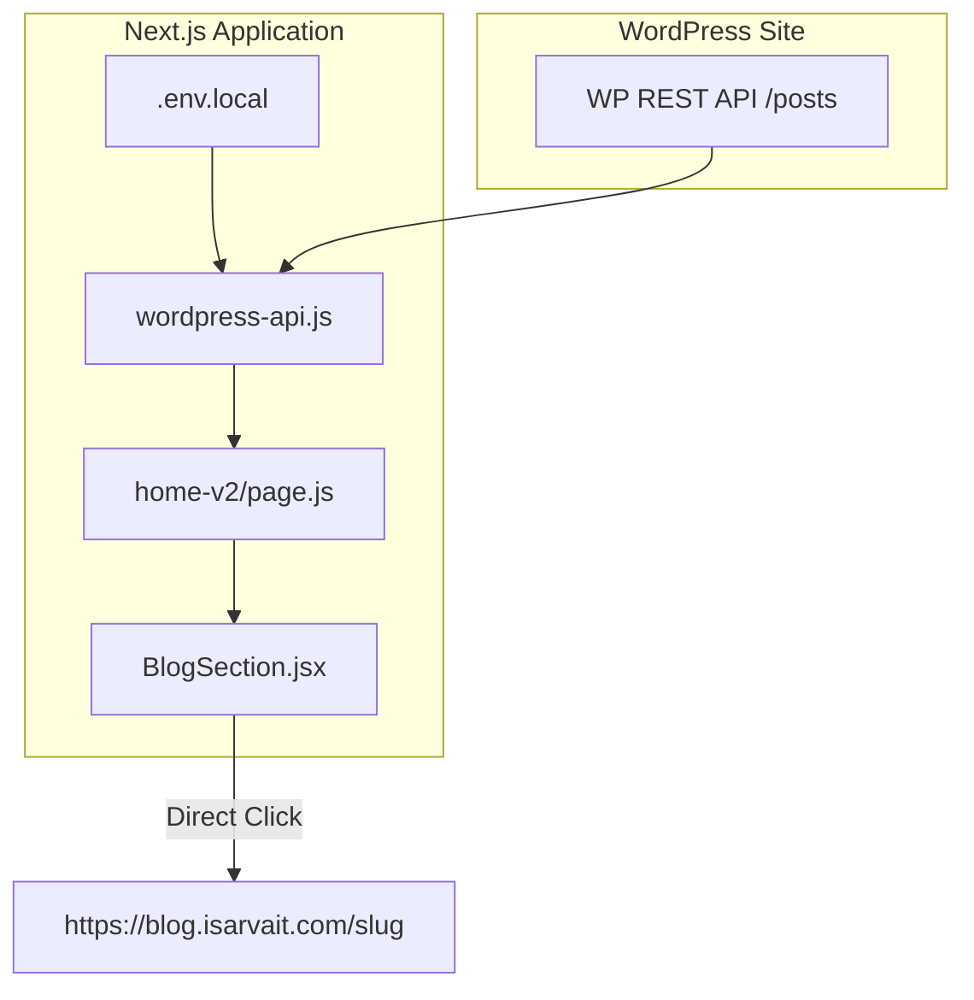

# WordPress Blog Integration Documentation

This document explains how WordPress blog posts from [blog.isarvait.com](https://blog.isarvait.com/) are fetched, processed, and integrated into the "Latest From Our Blog" section on the frontend (specifically on the `home-v2` page).

---

## Architecture Overview

The blog integration consists of four main layers:



---

## 1. Environment Configuration

The WordPress API base URL is configured in the environment variables.

* **File:** `.env.local`
* **Configuration:**
  ```env
  NEXT_PUBLIC_WORDPRESS_URL=https://blog.isarvait.com
  ```

---

## 2. API Utility Layer

The WordPress core fetch logic is implemented in the generic WordPress API module.

* **File:** [wordpress-api.js](file:///c:/Users/ISARVA/Desktop/IsarvaIt-Nextjs-wordpress/src/app/lib/api/wordpress-api.js)
* **Function:** `fetchPosts(options)`
* **Details:**
  - Calls `/wp-json/wp/v2/posts` on the target WordPress server.
  - Takes parameters like `perPage`, `orderby`, `order`, `fields`, and `embed`.
  - When `embed: true` is passed, it appends `_embed=1` to the query. This tells WordPress to return the associated entities (like featured media details and category term objects) in the same payload, saving extra network requests.

```javascript
export async function fetchPosts(options = {}) {
  if (!isWordPressAvailable()) {
    return [];
  }

  try {
    const {
      perPage = 10,
      orderby = 'date',
      order = 'desc',
      categories = '',
      revalidate = 60,
      embed = false,
      fields = 'id,title,slug,excerpt,date,featured_media',
    } = options;
    
    const categoryQuery = categories ? `&categories=${categories}` : '';
    const embedQuery = embed ? '&_embed=1' : '';
    
    const response = await fetch(
      `${WORDPRESS_API_URL}/wp-json/wp/v2/posts?per_page=${perPage}&orderby=${orderby}&order=${order}${categoryQuery}&_fields=${fields}${embedQuery}`,
      {
        next: { revalidate },
      }
    );

    if (!response.ok) {
      return [];
    }

    return await response.json();
  } catch (error) {
    return [];
  }
}
```

---

## 3. Server-Side Page Fetch & Transformation

The `home-v2` page retrieves the WordPress posts server-side and maps the raw response fields into the clean structure expected by our frontend UI components.

* **File:** [home-v2/page.js](file:///c:/Users/ISARVA/Desktop/IsarvaIt-Nextjs-wordpress/src/app/home-v2/page.js)
* **Logic:**
  1. Calls `fetchPosts` requesting the 4 latest posts with specific fields (`fields: "id,title,slug,excerpt,date,featured_media,categories,link"`) and `embed: true`.
  2. Maps the fields safely:
     - **Title:** Extracted from HTML-encoded JSON (`post.title?.rendered`).
     - **Featured Image:** Extracted from embedded media payload: `post._embedded?.["wp:featuredmedia"]?.[0]?.source_url`.
     - **Category Name:** Extracted from embedded terms payload: `post._embedded?.["wp:term"]?.[0]?.[0]?.name`.
     - **Read Time:** Dynamically estimated based on content word count (assuming 200 words per minute reading speed).
     - **Link:** Extracted from `post.link` (the full external post URL).
  3. **Graceful Fallback:** If the WordPress site is down or not configured, it catches the error and silently falls back to static placeholder posts.

```javascript
async function getWordPressBlogPosts() {
  try {
    const wpPosts = await fetchPosts({
      perPage: 4,
      fields: "id,title,slug,excerpt,date,featured_media,categories,link",
      embed: true,
      revalidate: 300,
    });

    if (wpPosts && wpPosts.length > 0) {
      return wpPosts.map((post) => ({
        id: post.id,
        title: post.title?.rendered || "",
        slug: post.slug,
        link: post.link || `https://blog.isarvait.com/${post.slug}/`,
        excerpt: post.excerpt?.rendered?.replace(/<[^>]+>/g, "") || "",
        date: new Date(post.date).toLocaleDateString("en-US", {
          year: "numeric",
          month: "long",
          day: "numeric",
        }),
        featuredImage: post._embedded?.["wp:featuredmedia"]?.[0]?.source_url || "https://images.unsplash.com/photo-1451187580459-43490279c0fa?auto=format&fit=crop&q=80&w=1200",
        categoryName: post._embedded?.["wp:term"]?.[0]?.[0]?.name || "Blog",
        categorySlug: post._embedded?.["wp:term"]?.[0]?.[0]?.slug || "blog",
        readTime: `${Math.ceil((post.content?.rendered?.replace(/<[^>]+>/g, "").split(" ").length || 300) / 200)} min read`,
      }));
    }
  } catch (e) {
    // Fallback to static posts
  }
  return getBlogPosts({ perPage: 4 });
}
```

---

## 4. UI Component Layer

The blog section renders the mapped post cards and handles navigation.

* **File:** [BlogSection.jsx](file:///c:/Users/ISARVA/Desktop/IsarvaIt-Nextjs-wordpress/src/app/components/BlogSection.jsx)
* **Routing Behaviour:**
  - Checks if a post contains a `.link` attribute.
  - If a `.link` exists (WordPress posts), the card links directly to that external page (`https://blog.isarvait.com/some-slug`) and opens it in a new tab (`target="_blank"`).
  - If no `.link` is present (static fallback posts), it falls back to the internal path `/blog/${post.slug}`.
  - The "View More Blog" buttons are explicitly configured to redirect users directly to `https://blog.isarvait.com/` in a new tab.

```javascript
{posts.map((post, index) => {
  const isExternal = !!post.link;
  const href = post.link || `/blog/${post.slug}`;
  return (
    <motion.article ...>
      <a
        href={href}
        target={isExternal ? "_blank" : "_self"}
        rel={isExternal ? "noopener noreferrer" : undefined}
      >
        {/* Post Card Layout */}
      </a>
    </motion.article>
  );
})}
```
